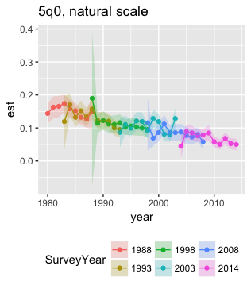
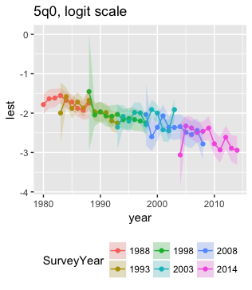
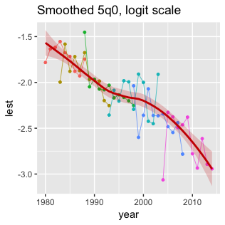
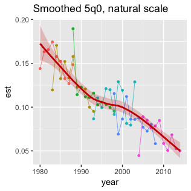
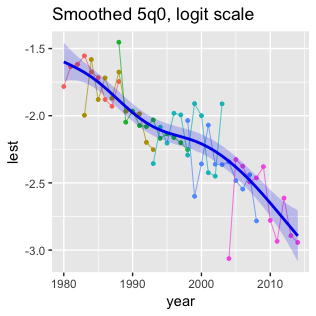
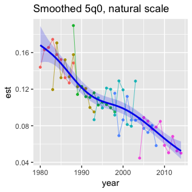
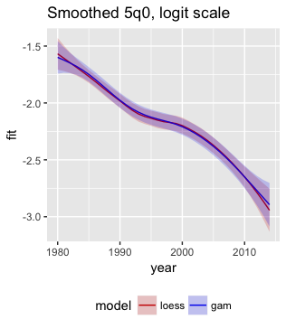

This vignette demonstrates using `demogsurv` and the package `mgcv` for simple 
model-based smoothing of child mortality estimates, with Ghana as an example.

Standard demographic ~n~q~x~ survival probability indicators for child mortality
(neonatal, postnatal, infant, child, etc.) and adult mortality (~45~q~15~) are
calculated as composite of age-specific mortality rates. There are two possible 
approaches for reaching smoothed trends for survival probability indicators:

1. Calculate direct estimates and design-based standard errors for quantities of 
   interest, followed by model-based smoothing of direct estimates.
1. Directly model trends in age-specific mortality rates, and then calculate 
   desired indicators as a function of model predictions for mortality rate trends.
   

Model-based approaches also provide an opportunity to adjust for known reporting
biases affecting estimates of child mortality trends, such as selective [omission
or transferral of child dates of birth outside a survey reference period](https://www.ncbi.nlm.nih.gov/pubmed/24303913).

We will use the R package [`mgcv`](https://cran.r-project.org/web/packages/mgcv/index.html) for model-based smoothing with penalized regression splines.


## Load packages


```r
## install.packages("devtools")
## devtools::install_github("OJWatson/rdhs")
## devtools::install_github("mrc-ide/demogsurv")

library(rdhs)
library(demogsurv)
library(mgcv)
library(ggplot2)
library(data.table)
library(haven)

## return rdhs API requests as data.table
Sys.setenv(rdhs_DATA_TABLE = "TRUE")
```


## Identify and load Birth Recode datasets

Use `rdhs` to identify and retrieve birth recode (BR) datasets for all DHS 
surveys conducted in Ghana.


```r
surveys <- dhs_surveys(countryIds = "GH", surveyType = "DHS")
brd <- dhs_datasets(fileType = "BR", fileFormat = "flat")[SurveyId %in% surveys$SurveyId]
brd$path <- unlist(get_datasets(brd$FileName))
```

Load the datasets into R as a list.


```r
br <- list()
for(survid in brd$SurveyId){
  print(survid)
  dat <- readRDS(brd[SurveyId == survid]$path)
  dat <- dat[grep("caseid|^v0|^v1|^b", names(dat))]
  br[[survid]] <- dat
}

## Remove any value labels from b7 (age at death in months)
br <- lapply(br, function(x){x$b7 <- zap_labels(x$b7); x})

## Convert to factors (a bit inefficient)
br <- lapply(br, haven::as_factor)

## Add survey-level variables
br <- Map(data.frame,
          SurveyId = surveys$SurveyId,
          CountryName = surveys$CountryName,
          SurveyYear = surveys$SurveyYear,
          br)
```

## Approach 1: smoothing direct ~n~q~x~ estimates

Calculate annual ~5~q~0~ estimates for period 0 to 10 years before the survey.


```r
br <- lapply(br, function(x){x$death <- x$b5 == "no"; x})
br <- lapply(br, function(x){x$dod <- x$b3 + x$b7 + 0.5; x})
u5mr <- lapply(br, calc_nqx, by=~SurveyId+CountryName+SurveyYear, strata=NULL,
               cluster=~v001, tips=c(0, 10), period=1980:2015)
u5mr <- do.call(rbind, u5mr)

knitr::kable(head(u5mr), row.names=FALSE, digits=3)
```


SurveyId    CountryName   SurveyYear   period   tips      est      se    ci_l    ci_u
----------  ------------  -----------  -------  -----  ------  ------  ------  ------
GH1988DHS   Ghana         1988         1980     0-9     0.144   0.016   0.113   0.174
GH1988DHS   Ghana         1988         1981     0-9     0.163   0.017   0.130   0.195
GH1988DHS   Ghana         1988         1982     0-9     0.166   0.016   0.133   0.197
GH1988DHS   Ghana         1988         1983     0-9     0.174   0.014   0.147   0.201
GH1988DHS   Ghana         1988         1984     0-9     0.158   0.014   0.129   0.185
GH1988DHS   Ghana         1988         1985     0-9     0.152   0.013   0.127   0.177

```r

## Remove years after survey year (small numbers of observations)
u5mr$year <- as.integer(as.character(u5mr$period))
u5mr <- subset(u5mr, year <= as.integer(as.character(SurveyYear)))

```

Logit transform estimate and variance. *Should we use c-log-log transform instead?*


```r
u5mr$lest <- qlogis(u5mr$est)
u5mr$l_se <- u5mr$se / (u5mr$est * (1 - u5mr$est))

ggplot(u5mr, aes(year, est, ymin = ci_l, ymax = ci_u,
                 color=SurveyYear, fill=SurveyYear)) +
  geom_point() +
  geom_line() +
  geom_ribbon(alpha=0.2, linetype="blank") +
  ggtitle("5q0, natural scale") +
  theme(legend.position="bottom")

ggplot(u5mr, aes(year, lest,
                 ymin = lest - qnorm(0.975)*l_se,
                 ymax = lest + qnorm(0.975)*l_se,
                 color=SurveyYear, fill=SurveyYear)) +
  geom_point() +
  geom_line() +
  geom_ribbon(alpha=0.2, linetype="blank") +
  ggtitle("5q0, logit scale") +
  theme(legend.position="bottom")
```



Smooth the logit-transformed ~5~q~0~ estimates using loess smoothing with
weighted least squares. Weights are taken to be proportional to the inverse
of the design-based variance.


```r
sm1 <- loess(lest ~ year, data=u5mr, weights = 1/l_se^2)
sm1pred <- data.frame(year = 1980:2014,
                      predict(sm1, data.frame(year = 1980:2014), se=TRUE))
sm1pred$ci_l <- with(sm1pred, fit - qnorm(0.975) * se.fit)
sm1pred$ci_u <- with(sm1pred, fit + qnorm(0.975) * se.fit)

## logit scale predictions
ggplot() +
  geom_point(data=u5mr, aes(year, lest, color=SurveyYear), size=1, show.legend=FALSE) +
  geom_line(data=u5mr, aes(year, lest, color=SurveyYear), size=0.25, show.legend=FALSE) +
  geom_line(data=sm1pred, aes(year, fit), size=1, col="red3") +
  geom_ribbon(data=sm1pred, aes(year, ymin=ci_l, ymax=ci_u),
              fill="red3", alpha=0.2) +
  ggtitle("Smoothed 5q0, logit scale")

## natural scale predictions
ggplot() +
  geom_point(data=u5mr, aes(year, est, color=SurveyYear), size=1, show.legend=FALSE) +
  geom_line(data=u5mr, aes(year, est, color=SurveyYear), size=0.25, show.legend=FALSE) +
  geom_line(data=sm1pred, aes(year, plogis(fit)), size=1, col="red3") +
  geom_ribbon(data=sm1pred, aes(year, ymin=plogis(ci_l), ymax=plogis(ci_u)),
              fill="red3", alpha=0.2) +
  ggtitle("Smoothed 5q0, natural scale")
```



We can do the same smoothing using weighted penalized regression splines in a
generalized additive model (GAM) frameowork.


```r
sm2 <- gam(lest ~ s(year), data=u5mr, weights = 1/l_se^2)
sm2pred <- data.frame(year = 1980:2014,
                      predict(sm2, data.frame(year = 1980:2014), se=TRUE))
sm2pred$ci_l <- with(sm2pred, fit - qnorm(0.975) * se.fit)
sm2pred$ci_u <- with(sm2pred, fit + qnorm(0.975) * se.fit)

## logit scale predictions
ggplot() +
  geom_point(data=u5mr, aes(year, lest, color=SurveyYear), size=1, show.legend=FALSE) +
  geom_line(data=u5mr, aes(year, lest, color=SurveyYear), size=0.25, show.legend=FALSE) +
  geom_line(data=sm2pred, aes(year, fit), size=1, col="blue2") +
  geom_ribbon(data=sm2pred, aes(year, ymin=ci_l, ymax=ci_u),
              fill="blue2", alpha=0.2) +
  ggtitle("Smoothed 5q0, logit scale")

## natural scale predictions
ggplot() +
  geom_point(data=u5mr, aes(year, est, color=SurveyYear), size=1, show.legend=FALSE) +
  geom_line(data=u5mr, aes(year, est, color=SurveyYear), size=0.25, show.legend=FALSE) +
  geom_line(data=sm2pred, aes(year, plogis(fit)), size=1, col="blue2") +
  geom_ribbon(data=sm2pred, aes(year, ymin=plogis(ci_l), ymax=plogis(ci_u)),
              fill="blue2", alpha=0.2) +
  ggtitle("Smoothed 5q0, natural scale")
```



Comparison of the `loess` and `gam` smoothing suggest they are relatively similar.
Other GAM specifications could be explored, but probably would not have a great
deal of affect in this example.


```r
smpred <- rbind(data.frame(model = "loess", sm1pred[c("year", "fit", "ci_l", "ci_u")]),
                data.frame(model = "gam",   sm2pred[c("year", "fit", "ci_l", "ci_u")]))

ggplot(smpred, aes(year, fit, ymin=ci_l, ymax=ci_u,
                   color = model, fill=model)) +
  geom_line() +
  geom_ribbon(alpha=0.2, linetype="blank") +
  scale_color_manual(values=c(loess="red3", gam="blue2")) +
  scale_fill_manual(values=c(loess="red3", gam="blue2")) +
  theme(legend.position="bottom") +
  ggtitle("Smoothed 5q0, logit scale")

ggplot(smpred, aes(year, plogis(fit), ymin=plogis(ci_l), ymax=plogis(ci_u),
                   color = model, fill=model)) +
  geom_line() +
  geom_ribbon(alpha=0.2, linetype="blank") +
  scale_color_manual(values=c(loess="red3", gam="blue2")) +
  scale_fill_manual(values=c(loess="red3", gam="blue2")) +
  theme(legend.position="bottom") +
  ggtitle("Smoothed 5q0, natural scale")
      
```




##### Strengths

* Relatively simple.
* Accounts for complex survey design via design-based standard errors.

##### Limitations

* Does not account for serial correlation in time-series of estimates arising
  from the same survey. This could be addressed by generalized least squares.
  
##### Further extensions

* Additional covariates such as indicator for time preceding survey could be 
  added to regression to adjust for biases.


## Approach 2: model age-specific mortality rates

*To be completed*
